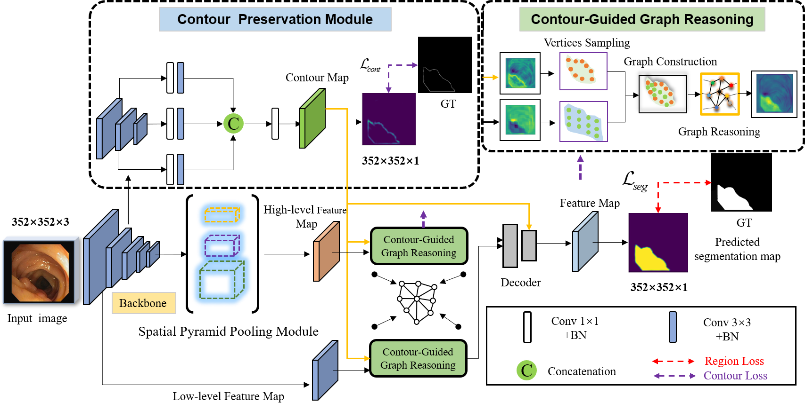
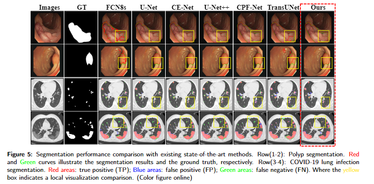
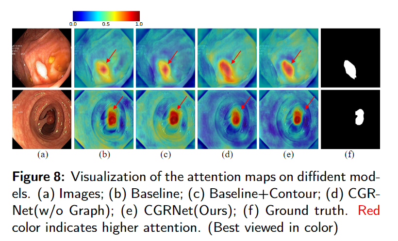

# CGRNet: Contour-Guided Graph Reasoning Network for Ambiguous Biomedical Image Segmentation
[](https://opensource.org/licenses/MIT) [](http://makeapullrequest.com)
<!-- TOC -->
> **Authors:** 
> Kun Wang,
> Xiaohong Zhang,
> Yuting Lu,
> Xiangbo Zhang,
> Wei Zhang.


## 0. Preface
- [2022/01/5]:**Submitted to the journal of "BSPC " （Under Review）**
- [2022/02/2]:**Submitted to the journal of "BSPC " 🔥（Minor Revision）**
- [2022/02/27]:**Submitted to the journal of "BSPC " 🔥（Accept）**


### 1.1. 🔥NEWS🔥 :
- [2021/10/30]:fire: Release the inference code!
- [2021/10/28] Create repository.


## Prerequisites
- [Python 3.5](https://www.python.org/)
- [Pytorch 1.1](http://pytorch.org/)
- [OpenCV 4.0](https://opencv.org/)
- [Numpy 1.15](https://numpy.org/)
- [TensorboardX](https://github.com/lanpa/tensorboardX)

## Clone repository
```shell
git clone https://github.com/DLWK/CGRNet.git
cd CGRNet/
```
## Download dataset
Download the datasets and unzip them into `data` folder
- [COVID-19](https://medicalsegmentation.com/covid19/)
- Download dataset from following [URL](https://drive.google.com/file/d/17Cs2JhKOKwt4usiAYJVJMnXfyZWySn3s/view?usp=sharing)
- You can use our data/dataloader2.py to load the datasets.
## Training & Evaluation
```shell
 cd CGRNet/
 python3 train.py
 ################
 python3 test.py
 
```

## Demo
```shell
from  CGRmodes.CGR import  CGRNet
if __name__ == '__main__':
    ras =CGRNet(n_channels=3, n_classes=1).cuda()
    input_tensor = torch.randn(4, 3, 352, 352).cuda()
    out,out1 = ras(input_tensor)
    print(out.shape) 
```
### 2.1 Overview framework
<p align="center">
     <br />
    <em> 
    </em>
</p>

### 2.2 Visualization Results
<p align="center">
     <br />
    <em> 
    </em>
</p>

<p align="center">
     <br />
    <em> 
    </em>
</p>


## Citation
- If you find this work is helpful, please cite our paper
```
@article{wang2022cgrnet,
  title={CGRNet: Contour-guided graph reasoning network for ambiguous biomedical image segmentation},
  author={Wang, Kun and Zhang, Xiaohong and Lu, Yuting and Zhang, Xiangbo and Zhang, Wei},
  journal={Biomedical Signal Processing and Control},
  volume={75},
  pages={103621},
  year={2022},
  publisher={Elsevier}
}
}
```


# Tips
:fire:If you have any questions about our work, please do not hesitate to contact us by emails.
**[⬆ back to top](#0-preface)**
